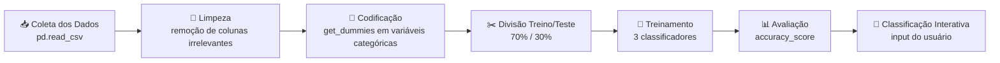

# 🎓 Classificador Pedagógico — Big Data & Machine Learning

[](https://www.python.org/)
[](https://scikit-learn.org/)
[](https://pandas.pydata.org/)
[]()
[]()

Projeto de extensão acadêmica da disciplina de **Big Data**, desenvolvido com dados pedagógicos **reais e anonimizados** de estudantes da educação especial da rede pública municipal de São Gonçalo/RJ. O objetivo é prever, por meio de algoritmos de Machine Learning, o **nível de suporte pedagógico** que cada estudante necessita — uma ferramenta de apoio à decisão para professores e coordenadores escolares.

> 🤝 Este repositório faz parte de um projeto em dupla. O dataset irmão — voltado à classificação de embarcações para a **Lotus Agência Marítima LTDA** — foi desenvolvido pelo colega Leandro Ferreira como parte do mesmo trabalho de extensão.

---

## 📑 Sumário

- [Sobre o Projeto](#-sobre-o-projeto)
- [Contexto e Parceiro Externo](#-contexto-e-parceiro-externo)
- [Dataset](#-dataset)
- [Pipeline de Machine Learning](#-pipeline-de-machine-learning)
- [Classificadores Avaliados](#-classificadores-avaliados)
- [Resultados](#-resultados)
- [Estrutura do Repositório](#-estrutura-do-repositório)
- [Como Executar](#-como-executar)
- [Equipe](#-equipe)
- [Referencial Teórico](#-referencial-teórico)
- [Considerações Éticas](#-considerações-éticas)
- [Trabalhos Futuros](#-trabalhos-futuros)

---

## 📌 Sobre o Projeto

Este projeto nasceu de uma problemática real identificada na rede municipal de ensino de São Gonçalo: **a ausência de um sistema de triagem baseado em dados** para apoiar professores na definição do nível de suporte pedagógico necessário a estudantes com necessidades educacionais especiais.

A decisão hoje depende quase exclusivamente do julgamento individual de cada educador, sem qualquer ferramenta analítica de apoio — o que pode gerar alocação inadequada de recursos de suporte. Para enfrentar esse problema, o projeto aplica um pipeline completo de ciência de dados (inspirado no processo **KDD — Knowledge Discovery in Databases**) para treinar classificadores capazes de prever esse nível de suporte com alta acurácia.

## 🤝 Contexto e Parceiro Externo

| | |
|---|---|
| **Parceira externa** | Luciana Vargas — Professora da rede pública municipal de São Gonçalo/RJ |
| **Escolas envolvidas** | Escola Municipal Darcy Ribeiro · Escola Municipal João Cabral de Melo Neto · Colégio Municipal Estephânia de Carvalho |
| **Estudantes contemplados** | 100 estudantes (6 a 14 anos), com diagnósticos como TDAH, TEA, Dislexia, Deficiência Física, Deficiência Intelectual e Transtorno de Ansiedade |
| **Instituição de ensino** | Universidade Estácio de Sá — Campus Alcântara |
| **Disciplina** | Big Data (Projeto de Extensão) |
| **Professor orientador** | Marcelo Teixeira |

## 🗂 Dataset

O conjunto de dados (`educacao_especial_sao_goncalo_registros.csv`) contém **100 registros** e **11 colunas**, com informações anonimizadas sobre cada estudante:

| Coluna | Descrição |
|---|---|
| `estudante_id` | Identificador anonimizado do estudante |
| `estudante_nome` | Nome fictício/anonimizado |
| `sexo` | Feminino / Masculino |
| `idade` | Idade do estudante (6 a 14 anos) |
| `escola` | Escola municipal de matrícula |
| `categoria_diagnostico` | Diagnóstico (TDAH, TEA, Dislexia, Deficiência Física, Deficiência Intelectual, Transtorno de Ansiedade) |
| `nivel_suporte` | **Variável-alvo** — Leve, Moderado ou Intensivo |
| `horas_suporte_por_semana` | Horas semanais de suporte pedagógico (20h ou 40h) |
| `plano_individualizado` | Possui plano individualizado de ensino (Sim/Não) |
| `desempenho_academico` | Nota de desempenho acadêmico (45 a 85) |
| `turno_academico` | Turno de estudo (1 = Manhã · 2 = Manhã e Tarde) |

```
<class 'pandas.core.frame.DataFrame'>
RangeIndex: 100 entries, 0 to 99
Data columns (total 11 columns):
 #   Column                     Non-Null Count  Dtype
---  ------                     --------------  -----
 0   estudante_id               100 non-null    object
 1   estudante_nome             100 non-null    object
 2   sexo                       100 non-null    object
 3   idade                      100 non-null    int64
 4   escola                     100 non-null    object
 5   categoria_diagnostico      100 non-null    object
 6   nivel_suporte              100 non-null    object
 7   horas_suporte_por_semana   100 non-null    int64
 8   plano_individualizado      100 non-null    object
 9   desempenho_academico       100 non-null    int64
 10  turno_academico            100 non-null    int64
```

## 🔄 Pipeline de Machine Learning

O fluxo de desenvolvimento seguiu as etapas clássicas de um processo de descoberta de conhecimento em dados (KDD):



**1. Limpeza dos dados** — remoção das colunas não preditivas (`estudante_id`, `estudante_nome`, `idade`, `sexo`, `escola`, `categoria_diagnostico`), mantendo apenas variáveis com poder discriminante direto sobre o nível de suporte.

**2. Codificação categórica** — aplicação de `pd.get_dummies()` na coluna `plano_individualizado`, gerando as colunas binárias `plano_individualizado_Sim` e `plano_individualizado_Não`.

**3. Divisão treino/teste** — `train_test_split(X, y, test_size=0.3, random_state=1)`, reservando 30% dos dados para validação do modelo.

Resultado da limpeza, pronto para treinamento:

```
<class 'pandas.core.frame.DataFrame'>
RangeIndex: 100 entries, 0 to 99
Data columns (total 6 columns):
 #   Column                      Non-Null Count  Dtype
---  ------                      --------------  -----
 0   nivel_suporte               100 non-null    object
 1   horas_suporte_por_semana    100 non-null    int64
 2   desempenho_academico        100 non-null    int64
 3   turno_academico             100 non-null    int64
 4   plano_individualizado_Não   100 non-null    int64
 5   plano_individualizado_Sim   100 non-null    int64
```

## 🧠 Classificadores Avaliados

Conforme exigido pela disciplina, três algoritmos supervisionados foram treinados e comparados:

| Arquivo | Algoritmo | Implementação |
|---|---|---|
| [`classificador_final.py`](classificador_final.py) | 🌳 Árvore de Decisão | `tree.DecisionTreeClassifier()` |
| [`classficador_svm_basico.py`](classficador_svm_basico.py) | 📐 SVM Básico | `svm.SVC()` |
| [`classificador_svm_pipeline.py`](classificador_svm_pipeline.py) | ⚙️ SVM com Pipeline | `make_pipeline(StandardScaler(), svm.SVC(gamma='auto'))` |

> 💡 Vale destacar que o script de SVM básico (`classficador_svm_basico.py`) testa uma abordagem alternativa de pré-processamento, aplicando `get_dummies` em **todas** as variáveis categóricas originais (sexo, escola, diagnóstico, plano), e não apenas nas mantidas no modelo final.

## 📈 Resultados

A **Árvore de Decisão** foi escolhida como classificador final do projeto, por unir alta acurácia à possibilidade de visualização gráfica — o que facilita a interpretação dos critérios de decisão por parte de professores e gestores escolares, mesmo sem conhecimento técnico em ciência de dados.

| Classificador | Acurácia |
|---|:---:|
| 🌳 Árvore de Decisão | **1,0 (100%)** |
| 📐 SVM Básico | **1,0 (100%)** |
| ⚙️ SVM com Pipeline | **0,8 (80%)** |

A variável `horas_suporte_por_semana` se mostrou o critério mais determinante na árvore: estudantes com até 30h semanais de suporte são separados em um primeiro nó, sendo o `desempenho_academico` o segundo fator decisivo para diferenciar o nível **Leve** do **Moderado**.

<div align="center">
  <p><em>Figura 1 — Árvore de Decisão treinada com os dados de educação especial de São Gonçalo</em></p>
  
  <p><em>===============================================================================</em></p>
</div>

<div align="center">
  <p><em>Figura 2 — Execução do programa: classificação interativa a partir de dados inseridos pelo usuário</em></p>
  
  <p><em>===============================================================================</em></p>
</div>

### 🚢 Comparativo com o projeto do colega de equipe

Como parte do mesmo trabalho de extensão, o colega Leandro Ferreira aplicou o mesmo pipeline a um dataset operacional cedido pela empresa **Lotus Agência Marítima LTDA** (411 registros de atracação de embarcações), obtendo 100% de acurácia nos três classificadores testados:

<div align="center">
  <p><em>Figura 3 — Árvore de Decisão do projeto do Colega (Lotus Agência Marítima LTDA)</em></p>
  
  <p><em>===============================================================================</em></p>
</div>

<div align="center">
  <p><em>Figura 2 — Execução do programa: classificação interativa a partir de dados inseridos pelo usuário</em></p>
  
  <p><em>===============================================================================</em></p>
</div>

## 📁 Estrutura do Repositório

```
projeto-academico-classificador-pedagogico/
├── classificador_final.py          # Árvore de Decisão + programa interativo (classificador final)
├── classficador_svm_basico.py      # SVM básico (SVC)
├── classificador_svm_pipeline.py   # SVM com pipeline (StandardScaler + SVC)
├── readme_assets/                  # Imagens utilizadas neste README
│   ├── arvore_decisao_pedagogico.png
│   ├── arvore_decisao_maritima.png
│   ├── execucao_pedagogico.png
│   ├── execucao_maritima.png
│   └── foto_dupla_laboratorio.png
└── README.md
```

> ⚠️ O arquivo `educacao_especial_sao_goncalo_registros.csv`, com os dados cedidos pela parceira externa, deve estar na mesma pasta dos scripts para a execução.

## ▶️ Como Executar

### Pré-requisitos

```bash
pip install pandas scikit-learn matplotlib
```

### Executando o classificador final (Árvore de Decisão)

```bash
python classificador_final.py
```

O programa solicitará interativamente os dados de um novo estudante:

```
Digite horas de suporte por semana (20h semanais ou 40h semanais): 40
Digite desempenho academico (45 a 85): 65
Digite o turno academico (1 = Manhã ou 2 = Manhã e Tarde): 1
Possui plano individualizado (Sim = 0 / Não = 1): 0

O Tratamento do aluno vai ser:  ['Moderado']
```

Ao final, a Árvore de Decisão treinada é exibida graficamente com `matplotlib`.

### Executando os demais classificadores

```bash
python classficador_svm_basico.py        # SVM básico
python classificador_svm_pipeline.py     # SVM com pipeline
```

## 👥 Equipe

<div align="center">
  
  <p><em>Da esquerda para a direita: Leandro Ferreira e Lucas Vargas — Laboratório de Informática, Campus Alcântara</em></p>
</div>

| Aluno | Matrícula | Responsabilidade |
|---|---|---|
| **Lucas Vargas Pina** | 202508628601 | Coleta e preparação dos dados de educação especial · Desenvolvimento dos classificadores deste repositório · Programa interativo |
| **Leandro Ferreira** | 202508162628 | Coleta e preparação dos dados marítimos · Desenvolvimento do classificador final do grupo (Lotus Agência Marítima LTDA) |

**Professor orientador:** Marcelo Teixeira — Universidade Estácio de Sá, Campus Alcântara

## 📚 Referencial Teórico

O projeto se apoia em quatro referências centrais:

- **FAYYAD, U.; PIATETSKY-SHAPIRO, G.; SMYTH, P.** *The KDD process for extracting useful knowledge from volumes of data*. Communications of the ACM, v. 39, n. 11, p. 27-34, 1996.
- **AZEVEDO, A. I. R. L.; SANTOS, M. F.** *KDD, SEMMA and CRISP-DM: a parallel overview*. IADS-DM, 2008.
- **RUSSEL, S.; NORVIG, P.** *Inteligência artificial*. 3. ed. São Paulo: GEN LTC, 2013.
- **BABBAR, P. et al.** *Connectionist model in Artificial Intelligence*. International Journal of Applied Engineering Research, v. 13, n. 7, p. 5154-5159, 2018.

## ⚖️ Considerações Éticas

Os dados utilizados, embora anonimizados, referem-se a crianças e adolescentes com necessidades educacionais especiais — um público que demanda cuidado redobrado no tratamento de informações. Este projeto reforça que um modelo de classificação deve ser entendido como **ferramenta de apoio à decisão pedagógica**, nunca como substituto do julgamento humano, do acompanhamento clínico ou do olhar individualizado que cada estudante merece.

## 🚀 Trabalhos Futuros

- Expandir o dataset com dados de mais escolas e municípios do Rio de Janeiro, ampliando a generalização do modelo.
- Incorporar a evolução do desempenho acadêmico ao longo do tempo, transformando o modelo em uma ferramenta preditiva longitudinal.
- Explorar arquiteturas conexionistas (redes neurais) como alternativa aos classificadores clássicos testados.
- Desenvolver um dashboard interativo (Streamlit/Dash) para que professores sem conhecimento de programação possam utilizar o modelo diretamente.

---

<div align="center">

📘 Projeto de Extensão — Disciplina de Big Data  
**Universidade Estácio de Sá** · Campus Alcântara · 2026

</div>
